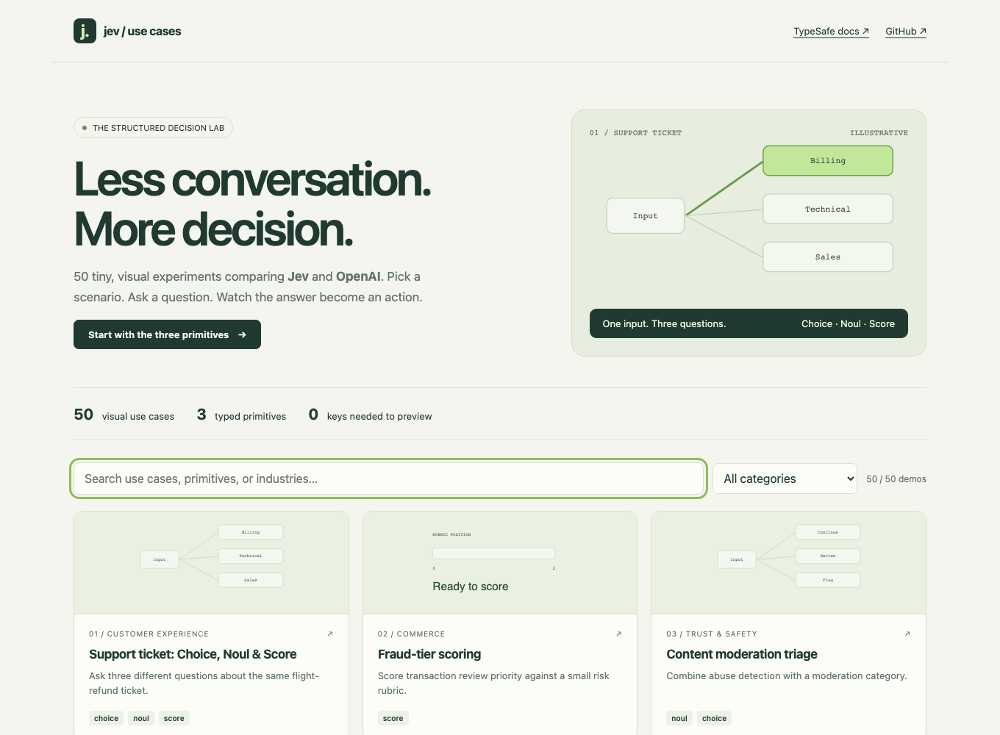

# Awesome Jev Use Cases — 50 Visual Jev vs OpenAI Demos

**50 minimal, interactive examples of TypeSafe Jev’s Choice, Score and Noul primitives, compared side by side with OpenAI’s Responses API (`gpt-6-astra`).** Each use case has its own folder, two synthetic scenarios, a small 2D visual and a runnable JavaScript example.

No frontend framework. No database. Preview without keys; add your own keys when you want real responses.



[Quick start](#quick-start) · [Three primitives](#one-ticket-three-primitives) · [All 50 use cases](#all-50-use-cases) · [Methodology](docs/methodology.md) · [Research sources](docs/research.md)

## Quick start

Requires Node.js 22.9 or later.

```bash
git clone https://github.com/whyashthakker/awesome-jev-use-cases.git
cd awesome-jev-use-cases
npm install
npm start
```

Open **http://127.0.0.1:3000**. Choose a demo and click **Run comparison**. Preview mode uses clearly labeled, hand-authored fixtures. No key or API call is needed.

### Add keys later

```bash
cp .env.example .env
```

Add these values to the local `.env` file, then restart `npm start`:

```dotenv
TYPESAFE_API_KEY=your_typesafe_key
OPENAI_API_KEY=your_openai_key
JEV_MODEL=jev-latest
OPENAI_MODEL=gpt-6-astra
```

Select **Live · use my API keys** in a demo. Each comparison makes one paid request to each provider. Keys stay on the local Node server and are never sent to the browser. The server binds to loopback only and serves a fixed list of public files.

The **OpenAI baseline** under Options defaults to **Structured Outputs**. You can also try plain text prompted to return JSON. Both modes use `client.responses.create()` and `response.output_text`; output is validated before it drives the visual.

### Run a single folder from the terminal

```bash
# Preview; no keys required
node --env-file-if-exists=.env use-cases/01-support-ticket-routing/run.js

# Live; requires both keys
node --env-file-if-exists=.env use-cases/01-support-ticket-routing/run.js --live

# Second scenario; plain-text OpenAI baseline
npm run demo -- 01-support-ticket-routing --live --scenario=1 --text
```

## One ticket, three primitives

The first demo uses the course’s exact running example:

> My flight was cancelled and I need a refund before Friday, this is honestly ridiculous.

| Primitive | Question | Jev returns |
| --- | --- | --- |
| **Choice** | Which department: billing, technical or sales? | One option, a distribution across all options, and confidence |
| **Noul** | Does this message request a refund? | One yes/no probability from 0 to 1; no separate confidence |
| **Score** | How frustrated: calm, concerned or very angry? | A probability-weighted score from 0 to 2, a distribution and confidence |

[Open the three-primitives example](use-cases/01-support-ticket-routing/). Run Choice, Noul or Score separately, or all three together on the same input. The preview’s 87% billing / 13% technical / 0% sales, refund 0.95 and frustration 1.65 are **illustrations, not measured Jev outputs**.

A Noul near **0.5 means uncertainty**, not medium intensity. For independent conditions such as urgency, refund intent and competitor mention, ask one Noul per condition. A Score can land between levels. Questions in a batch are independent; compose their answers in code. See [TypeSafe primitives](https://docs.typesafe.ai/primitives).

## Jev vs a typical LLM: what actually differs?

| Aspect | Jev | OpenAI baseline here |
| --- | --- | --- |
| API | TypeSafe System One | OpenAI Responses |
| Default model | `jev-latest` | `gpt-6-astra` |
| Output | Native Choice, Score, Noul answers | Generated JSON constrained by a schema |
| Choice / Score distributions | Returned natively | Not fabricated by this demo |
| Confidence | Native for Choice and Score | No directly comparable native value used |
| Text generation | Not the purpose of this interface | Useful for prose, explanations and synthesis |
| Timing and usage | Recorded only in live runs | Recorded only in live runs |

Both receive the **same state and question definitions**. OpenAI can produce reliable structured output too; the comparison does not deliberately force a prose-only baseline. A fixed choice may make generation unnecessary for that step, but it does not establish that Jev wins on quality, speed or cost.

**No benchmark winner is claimed.** Preview results are fixtures shared by both panels. Live latency includes network time; tokens are provider-reported and are not directly equivalent costs. Native Jev probabilities and OpenAI self-reported probability estimates should not be treated as interchangeable. [Read the comparison methodology](docs/methodology.md).

## All 50 use cases

The examples cover the TypeSafe documentation and recurring workflows in primary technical sources. They are a curated collection, **not a measured popularity ranking**. “Why a typed decision fits” describes the bounded step, not every part of an end-to-end application.

| # | Use case | Primitive | Why a typed decision fits |
| --- | --- | --- | --- |
| 01 | [Support ticket: Choice, Noul & Score](use-cases/01-support-ticket-routing/) | Choice + Noul + Score | The application needs one queue key per ticket; a written answer adds no routing value. |
| 02 | [Fraud-tier scoring](use-cases/02-fraud-tier-scoring/) | Score | A review queue consumes a bounded score, not a generated fraud report. |
| 03 | [Content moderation triage](use-cases/03-content-moderation/) | Noul + Choice | A high-volume triage step needs a flag and a category before human review. |
| 04 | [Game NPC decisions](use-cases/04-game-npc/) | Choice | A game loop consumes an action enum; dialogue generation is a separate task. |
| 05 | [Feature-flag eligibility](use-cases/05-feature-flag-routing/) | Choice | Semantic eligibility can be a fixed choice; experiment assignment itself belongs in deterministic code. |
| 06 | [LLM output guardrail](use-cases/06-output-guardrail/) | Noul | The check should return a narrow risk signal that code can act on. |
| 07 | [Map-reduce classification](use-cases/07-map-reduce-classification/) | Choice | A dataset job needs labels and aggregation, not one explanation per record. |
| 08 | [Voice-agent turn-taking](use-cases/08-voice-turn-taking/) | Noul | A conversational controller needs a stop-or-continue signal, not prose. |
| 09 | [Inventory pressure scoring](use-cases/09-inventory-pricing/) | Score | Code can consume a semantic pressure score and own all price calculations. |
| 10 | [Recommendation re-ranking](use-cases/10-recommendation-reranking/) | Score | A page needs an ordered candidate list, not a shopping essay. |
| 11 | [Jev as judge](use-cases/11-jev-as-judge/) | Choice | An evaluator can emit a winner without generating a critique. |
| 12 | [Traffic signal selection](use-cases/12-traffic-signals/) | Choice | The controller needs a phase enum and code-enforced interlocks. |
| 13 | [Autonomous driving decisions](use-cases/13-autonomous-driving/) | Choice | The next maneuver is a closed action set, while motion and collision checks belong in code. |
| 14 | [Adaptive e-learning](use-cases/14-adaptive-learning/) | Choice | A learning path needs a next-step ID; teaching prose can be generated separately. |
| 15 | [Student answer scoring](use-cases/15-answer-rubric/) | Score | A formative feedback widget needs a rubric score before composing feedback. |
| 16 | [Smart home intent](use-cases/16-smart-home/) | Choice | Home automation needs a bounded command, not an essay. |
| 17 | [Warehouse robot routing](use-cases/17-warehouse-robot/) | Choice | A robot planner can consume an enum while a geometric planner owns movement. |
| 18 | [Delivery exception routing](use-cases/18-delivery-exception/) | Choice | Operations needs a queue key for each exception. |
| 19 | [Incident severity triage](use-cases/19-incident-severity/) | Score | On-call routing needs a severity value before a long incident summary. |
| 20 | [Alert deduplication](use-cases/20-alert-deduplication/) | Noul | The system needs a grouping signal, not two generated summaries. |
| 21 | [Customer churn signals](use-cases/21-churn-signal/) | Score | An account dashboard needs a signal rather than a generated account plan. |
| 22 | [Inbound lead intent](use-cases/22-lead-intent/) | Choice | A CRM needs a known next step before a salesperson writes a response. |
| 23 | [Refund request routing](use-cases/23-refund-routing/) | Choice | A queue classifier needs a reason code; refund eligibility stays in policy code. |
| 24 | [Email urgency triage](use-cases/24-email-priority/) | Noul | A priority badge needs one urgency signal rather than an email summary. |
| 25 | [Review sentiment](use-cases/25-review-sentiment/) | Score | A review dashboard needs a numeric summary suitable for aggregation. |
| 26 | [Spam detection](use-cases/26-spam-detection/) | Noul | A message filter needs a compact signal for every message. |
| 27 | [Personal-data screening](use-cases/27-pii-screening/) | Noul | A publishing gate needs a review flag, not a prose privacy audit. |
| 28 | [Prompt injection triage](use-cases/28-prompt-injection/) | Noul | A retrieval gate needs a risk signal before generation starts. |
| 29 | [RAG passage filtering](use-cases/29-rag-passage-filter/) | Noul | Retrieval code needs keep/drop signals before handing context to a generator. |
| 30 | [Citation support checking](use-cases/30-citation-check/) | Choice | A source check needs supported, contradicted or unknown. |
| 31 | [Search result re-ranking](use-cases/31-search-reranking/) | Score | Search needs relevance scores, not generated page summaries. |
| 32 | [Semantic line search](use-cases/32-semantic-line-search/) | Choice | The caller needs an existing span identifier, not generated text. |
| 33 | [Agent tool routing](use-cases/33-tool-routing/) | Choice | An agent orchestrator needs a function name to dispatch. |
| 34 | [Agent skill selection](use-cases/34-skill-selection/) | Choice + Noul | The agent needs one catalog ID or a no-skill branch. |
| 35 | [Model escalation routing](use-cases/35-model-escalation/) | Choice | A dispatcher needs a route; expensive generation can be reserved for the selected handler. |
| 36 | [Confidence-gated support routing](use-cases/36-confidence-escalation/) | Choice | The queue needs both an answer and a separate decision about whether to trust it. |
| 37 | [Composite response quality](use-cases/37-response-quality/) | Score | An evaluation pipeline needs independent dimensions and explicit weights. |
| 38 | [Structured extraction verifier](use-cases/38-extraction-verifier/) | Noul | A cascade needs a pass-or-review signal, not regenerated extraction. |
| 39 | [Pre-parsed email selection](use-cases/39-email-span-extraction/) | Choice | The caller needs an existing span ID instead of a newly generated email address. |
| 40 | [Date component extraction](use-cases/40-date-component-extraction/) | Choice | Typed choices can extract components while date validation and arithmetic stay in code. |
| 41 | [Document structure recovery](use-cases/41-document-layout/) | Choice | A renderer needs block types; it should preserve the original text. |
| 42 | [Knowledge graph entity alignment](use-cases/42-entity-resolution/) | Choice | A graph pipeline needs merge, separate or review rather than generated descriptions. |
| 43 | [Hierarchical product classification](use-cases/43-taxonomy-classification/) | Choice | Catalog code needs a stable taxonomy ID, not an invented category. |
| 44 | [Contract clause triage](use-cases/44-contract-clause-triage/) | Choice | Review software needs a clause type before applying a checklist. |
| 45 | [Policy checklist screening](use-cases/45-policy-compliance/) | Noul | A publishing workflow needs a policy flag, not a general compliance essay. |
| 46 | [Product attribute extraction](use-cases/46-product-attribute/) | Choice | A filter index needs a canonical material key instead of free-form text. |
| 47 | [Ad placement brand safety](use-cases/47-brand-safety/) | Noul | An ad pipeline needs a suitability flag per placement. |
| 48 | [Demand signal extraction](use-cases/48-demand-features/) | Score | A forecasting pipeline needs semantic numeric features alongside historical data. |
| 49 | [Maintenance report triage](use-cases/49-maintenance-triage/) | Choice | A work-order system needs a trade or review queue. |
| 50 | [Speculative support fan-out](use-cases/50-speculative-fanout/) | Choice + Noul | One typed batch can prepare multiple branches without generating a workflow narrative. |

## Tiny project structure

```text
use-cases/
  01-support-ticket-routing/
    scenario.json   # State, questions, two fixtures and decision policy
    index.html      # Minimal visual comparison
    run.js          # Runnable CLI entry point
    README.md       # Explanation, commands and primary sources
  ...49 more folders
shared/
  providers.js      # Jev HTTP call + OpenAI Responses call
  engine.js         # Validation and local decisions
  visual.js         # Small SVG scenes
  app.js            # Plain browser JavaScript
server.js           # Local server; keeps keys private
```

All examples share the same tiny runner so provider code is not copied into 50 places. Inspect [the API calls](shared/providers.js) or a folder’s `scenario.json` to understand an example.

## Build and verify

```bash
npm run check                    # Build all pages + unit/integration checks
npx playwright install chromium  # Once, if running browser checks
npm run test:browser             # Every demo, both scenarios, desktop/mobile
```

The checks use fixtures and mocked provider transports; they do not spend API credits or prove live provider quality. Add keys and use Live for your own measurements.

`npm run build` also writes a **static preview site** to `dist/`. To publish it under your own URL, set `SITE_URL` when building so canonical links and a sitemap use the real destination. [SEO and AI discovery details](docs/seo-geo.md). No site deployment is required to run locally.

## FAQ

### Is Jev a replacement for all LLM use cases?

No. These demos focus on bounded semantic judgments. Use a generative model for writing, code, explanations or multi-step synthesis. Use ordinary code for arithmetic, hard constraints, permissions and stable A/B assignment. [TypeSafe’s documented limitations](https://docs.typesafe.ai/model-jaggedness/jev-1.13) explain the distinction.

### Can I edit the input?

Yes, in live mode. Both providers receive the same edited state. Preview mode always uses the selected authored fixture so it cannot pretend to evaluate new input.

### Do the driving, traffic, NPC and voice demos run real systems?

No. They show one decision in a tiny scene. There is no vehicle, traffic-light, game-engine or audio integration, and no real-time latency guarantee.

### Is the API key required for the website?

Only for local live comparisons. The static gallery and every fixture preview work without keys. Never put keys into frontend code or a public static host.

### Where did the use cases come from?

The TypeSafe documentation index, patterns and cookbooks, the requested course examples, and primary sources from AWS, OpenAI, Cohere, Anthropic, LiveKit, SUMO and Farama. Each folder links its sources. [Research notes](docs/research.md).

## Contributing and license

See [CONTRIBUTING.md](CONTRIBUTING.md). MIT licensed; see [LICENSE](LICENSE). This is a community project and is not affiliated with or endorsed by TypeSafe or OpenAI.
